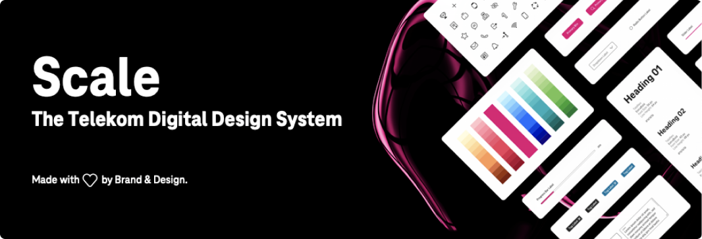

Scale is the Telekom digital design system for products and experiences. Build your online products faster and create superior experiences with ease. With production-ready components in code and design, a centrally accessible library and comprehensive documentation, Scale gives you everything you need to make it happen. Scale is currently an open beta.

The library offers a set of customizable UI components written in `TypeScript`. The default `theme` of the library can be easily replaced so that a corresponding corporate identity of a dedicated brand can be represented.

[](https://user-content.gitlab-static.net/376a8c0895adde2b9c040c2637e0c073fe366f0b/68747470733a2f2f696d672e736869656c64732e696f2f62616467652f74656c656b6f6d2d7363616c652d2532336532303037342e737667) [](https://user-content.gitlab-static.net/c157b3f97237128f7b5ee42d0364696ed37c1eae/68747470733a2f2f696d672e736869656c64732e696f2f6769746875622f6c6963656e73652f74656c656b6f6d2f7363616c652e7376673f7374796c653d666c61742d737175617265) [](https://user-content.gitlab-static.net/28a77f2ed685e83585790e174c938ea3fcfb9ec8/68747470733a2f2f696d672e736869656c64732e696f2f6769746875622f6c616e6775616765732f636f64652d73697a652f74656c656b6f6d2f7363616c652e7376673f7374796c653d666c61742d737175617265) [](https://user-content.gitlab-static.net/89327ec0370bd36e34419f0f179378a8bf2c101a/68747470733a2f2f696d672e736869656c64732e696f2f6769746875622f7265706f2d73697a652f74656c656b6f6d2f7363616c652e7376673f7374796c653d666c61742d737175617265)

# Welcome to Scale

Access the [complete documentation of Scale](https://www.brand-design.telekom.com/scale/) on [Telekom Brand & Design](https://www.brand-design.telekom.com/).

## Setup with NPM

Install the Scale component library in your project with npm or yarn:

```
npm install @scaleds/components-telekom
```

Notice the Telekom Brand assets Logos, Magenta, Typeface and Icons as well as the Footer and Header Components are protected under a [special license to use for Telekom Products only](https://github.com/telekom/scale/packages/components/src/telekom/LICENSE).

**MIT Version**
We provide a package for the open source community. The Scale Default Package uses a neutral theme and is fully covered by MIT license.

```
npm install @scaleds/components
```

To use the components, you need to load a CSS file and some JavaScript. The CSS file includes the fonts and the design tokens.

### Plain HTML

```bash
<link rel="stylesheet" href="node_modules/@scaleds/components-telekom/dist/scale-components/scale-components.css">
<script type="module" src="node_modules/@scaleds/components-telekom/dist/scale-components/scale-components.js"></script>
```

**MIT Version**

```bash
<link rel="stylesheet" href="node_modules/@scaleds/components/dist/scale-components/scale-components.css">
<script type="module" src="node_modules/@scaleds/components/dist/scale-components/scale-components.js"></script>
```

####

### With a bundler or ES modules

```bash
import "@scaleds/components-telekom/dist/scale-components/scale-components.css";
import { applyPolyfills, defineCustomElements } from "@scaleds/components-telekom/loader";

applyPolyfills().then(() => {
  defineCustomElements(window);
});
```

**MIT Version**

```bash
import "@scaleds/components/dist/scale-components/scale-components.css";
import { applyPolyfills, defineCustomElements } from "@scaleds/components/loader";

applyPolyfills().then(() => {
  defineCustomElements(window);
});
```


### Monorepo Packages Overview

| Package Name       | Description                                                |
| ------------------ | ---------------------------------------------------------- |
| components         | Stencil components                                         |
| components-angular | Component proxies for Angular (auto-generated)             |
| components-react   | Component proxies for React (auto-generated)               |
| components-sketch  | Component templates for Sketch generation (auto-generated) |
| components-vue     | Component proxies for Vue (auto-generated)                 |
| design-token       | Design tokens                                              |
| generator-sketch   | Sketch generator                                           |
| html-to-sketch     | Component template Sketch conversion utilities             |
| storybook-vue      | Our Storybook                                              |
| visual-tests       | Visual Snapshot Testing                                    |

### NPM Packages

| Package Name                        | Description                   |
| ----------------------------------- | ----------------------------- |
| @scaleds/components-telekom         | Stencil components            |
| @scaleds/components-react-telekom   | Component proxies for React   |
| @scaleds/components-vue-telekom     | Component proxies for Vue     |
| @scaleds/components-angular-telekom | Component proxies for Angular |

**NPM Packages MIT version**

| Package Name                | Description                   |
| --------------------------- | ----------------------------- |
| @scaleds/components         | Stencil components            |
| @scaleds/components-react   | Component proxies for React   |
| @scaleds/components-vue     | Component proxies for Vue     |
| @scaleds/components-angular | Component proxies for Angular |

## Frameworks

- [Scale and Vue](https://www.brand-design.telekom.com/scale/?path=/story/scale-for-developers-scale-and-vue--page)
- [Scale and Angular](https://www.brand-design.telekom.com/scale/?path=/story/scale-for-developers-scale-and-angular--page)
- [Scale and React](https://www.brand-design.telekom.com/scale/?path=/story/scale-for-developers-scale-and-react--page)

**MIT Version**

- [Vue Boilerplate](https://github.com/telekom/scale/examples/boilerplate-vue)
- [Angular Boilerplate](https://github.com/telekom/scale/examples/boilerplate-angular)
- [React Boilerplate](https://github.com/telekom/scale/examples/boilerplate-react)

---

[Find more Documentation on Storybook](https://www.brand-design.telekom.com/scale/)

[Find Scale on GitHub](https://github.com/telekom/scale)
