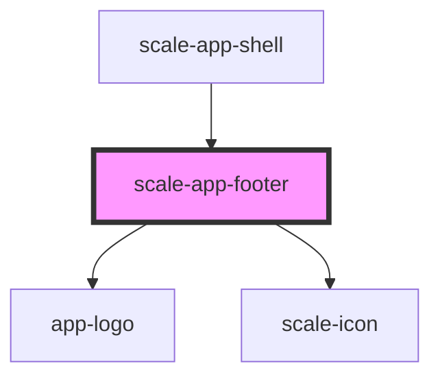

# scale-app-footer

<!-- Auto Generated Below -->

## Properties

| Property           | Attribute      | Description | Type     | Default     |
| ------------------ | -------------- | ----------- | -------- | ----------- |
| `claimLang`        | `claim-lang`   |             | `string` | `undefined` |
| `customClass`      | `custom-class` |             | `string` | `''`        |
| `footerNavigation` | --             |             | `any[]`  | `[]`        |

## Dependencies

### Used by

 - [scale-app-shell](../app-shell)

### Depends on

- [app-logo](../app-logo)
- [scale-icon](../icon)

### Graph

----------------------------------------------

*Built with [StencilJS](https://stenciljs.com/)*
