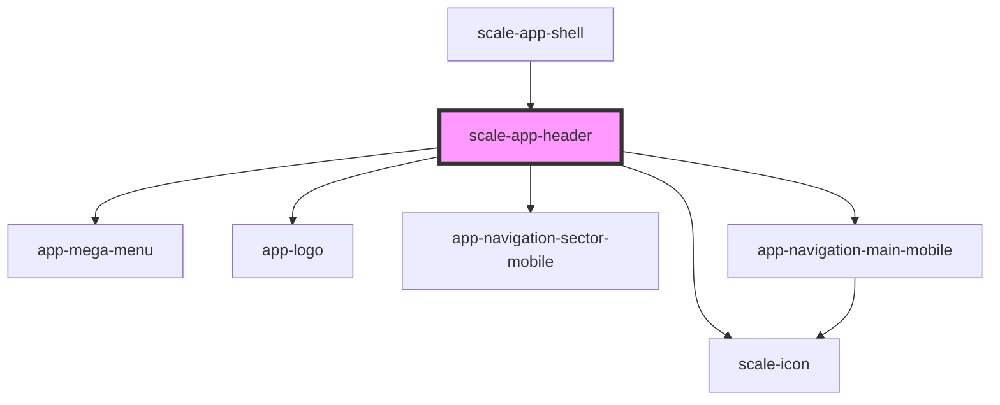

# scale-header

<!-- Auto Generated Below -->

## Properties

| Property           | Attribute      | Description | Type      | Default |
| ------------------ | -------------- | ----------- | --------- | ------- |
| `addonNavigation`  | --             |             | `any[]`   | `[]`    |
| `customClass`      | `custom-class` |             | `string`  | `''`    |
| `iconNavigation`   | --             |             | `any[]`   | `[]`    |
| `mainNavigation`   | --             |             | `any[]`   | `[]`    |
| `scrolled`         | `scrolled`     |             | `boolean` | `false` |
| `sectorNavigation` | --             |             | `any[]`   | `[]`    |

## Dependencies

### Used by

 - [scale-app-shell](../app-shell)

### Depends on

- [app-mega-menu](../app-mega-menu)
- [scale-icon](../icon)
- [app-logo](../app-logo)
- [app-navigation-sector-mobile](../app-navigation-sector-mobile)
- [app-navigation-main-mobile](../app-navigation-main-mobile)

### Graph

----------------------------------------------

*Built with [StencilJS](https://stenciljs.com/)*
