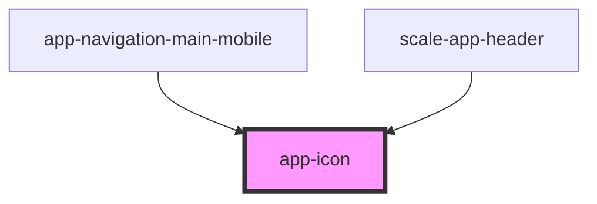

# app-icon

<!-- Auto Generated Below -->

## Properties

| Property | Attribute | Description | Type     | Default          |
| -------- | --------- | ----------- | -------- | ---------------- |
| `fill`   | `fill`    |             | `string` | `'currentColor'` |
| `name`   | `name`    |             | `string` | `undefined`      |
| `size`   | `size`    |             | `number` | `24`             |

## Dependencies

### Used by

 - [app-navigation-main-mobile](../app-navigation-main-mobile)
 - [scale-app-header](../app-header)

### Graph

----------------------------------------------

*Built with [StencilJS](https://stenciljs.com/)*
