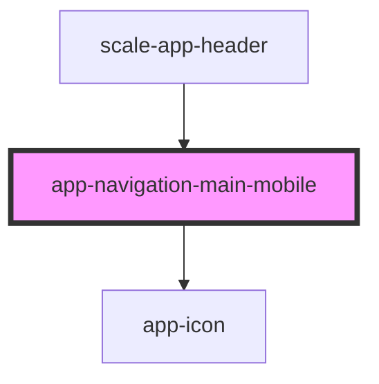

# app-navigation-main-mobile

<!-- Auto Generated Below -->

## Properties

| Property     | Attribute | Description | Type         | Default     |
| ------------ | --------- | ----------- | ------------ | ----------- |
| `navigation` | --        |             | `MenuItem[]` | `undefined` |

## Events

| Event       | Description | Type               |
| ----------- | ----------- | ------------------ |
| `closeMenu` |             | `CustomEvent<any>` |

## Dependencies

### Used by

 - [scale-app-header](../app-header)

### Depends on

- [app-icon](../app-icon)

### Graph

----------------------------------------------

*Built with [StencilJS](https://stenciljs.com/)*
