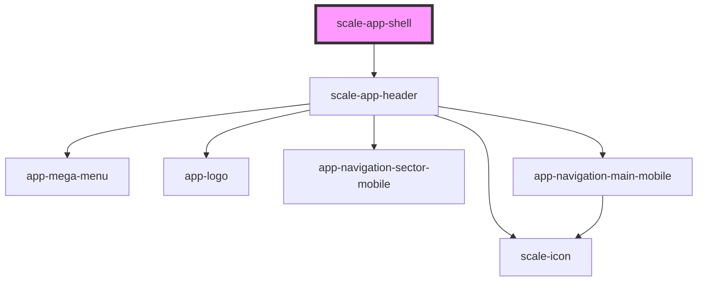

# scale-shell

<!-- Auto Generated Below -->

## Properties

| Property           | Attribute           | Description | Type     | Default |
| ------------------ | ------------------- | ----------- | -------- | ------- |
| `activeRouteId`    | `active-route-id`   |             | `string` | `''`    |
| `activeSectorId`   | `active-sector-id`  |             | `string` | `''`    |
| `addonNavigation`  | `addon-navigation`  |             | `any`    | `[]`    |
| `brandTitle`       | `brand-title`       |             | `string` | `''`    |
| `claimLang`        | `claim-lang`        |             | `string` | `'de'`  |
| `customClass`      | `custom-class`      |             | `string` | `''`    |
| `iconNavigation`   | `icon-navigation`   |             | `any`    | `[]`    |
| `mainNavigation`   | `main-navigation`   |             | `any`    | `[]`    |
| `portalName`       | `portal-name`       |             | `string` | `''`    |
| `sectorNavigation` | `sector-navigation` |             | `any`    | `[]`    |

## Dependencies

### Depends on

- [scale-app-header](../app-header)

### Graph

----------------------------------------------

*Built with [StencilJS](https://stenciljs.com/)*
