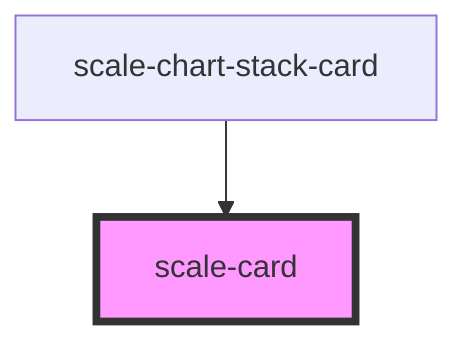

# scale-card

<!-- Auto Generated Below -->

## Usage

### Card

# Default

<scale-card>
  <h1>Card Title</h1>
  
This is card content

</scale-card>

### Card-interactive

### Interactive

<scale-card href="http://example.com" target="_blank">
  
click me

</scale-card>

## Properties

| Property      | Attribute      | Description                    | Type      | Default     |
| ------------- | -------------- | ------------------------------ | --------- | ----------- |
| `customClass` | `custom-class` | (optional) Card class          | `string`  | `''`        |
| `disabled`    | `disabled`     | (optional) Link disabled       | `boolean` | `false`     |
| `href`        | `href`         | (optional) Link card           | `string`  | `''`        |
| `interactive` | `interactive`  | (optional) Link interactive    | `boolean` | `false`     |
| `label`       | `label`        | (optional) Label of the card   | `string`  | `''`        |
| `noPadding`   | `no-padding`   | (optional) Padding off         | `boolean` | `false`     |
| `styles`      | `styles`       | (optional) Injected jss styles | `any`     | `undefined` |
| `target`      | `target`       | (optional) Link card target    | `string`  | `'_self'`   |

## Dependencies

### Used by

 - [scale-chart-stack-card](../chart-stack-card)

### Graph

----------------------------------------------

*Built with [StencilJS](https://stenciljs.com/)*
