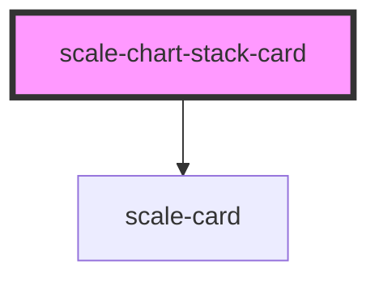

# scale-chart-stack-card

<!-- Auto Generated Below -->

## Properties

| Property      | Attribute      | Description                    | Type                                                            | Default     |
| ------------- | -------------- | ------------------------------ | --------------------------------------------------------------- | ----------- |
| `customClass` | `custom-class` | (optional) Custom class        | `string`                                                        | `''`        |
| `data`        | `data`         | Chart Data                     | `Record<"type" \| "value" \| "percentage", string>[] \| string` | `undefined` |
| `heading`     | `heading`      | Chart Title                    | `string`                                                        | `undefined` |
| `styles`      | `styles`       | (optional) Injected jss styles | `any`                                                           | `undefined` |

## Dependencies

### Depends on

- [scale-card](../card)

### Graph

----------------------------------------------

*Built with [StencilJS](https://stenciljs.com/)*
