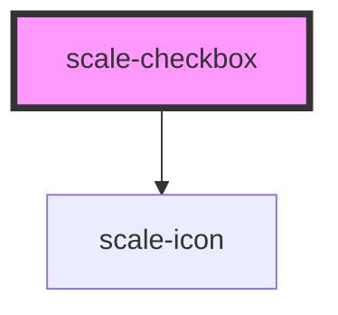

# scale-checkbox

<!-- Auto Generated Below -->

## Properties

| Property     | Attribute     | Description                            | Type               | Default                                                                                     |
| ------------ | ------------- | -------------------------------------- | ------------------ | ------------------------------------------------------------------------------------------- |
| `checked`    | `checked`     | (optional) Active switch               | `boolean`          | `false`                                                                                     |
| `disabled`   | `disabled`    | (optional) Input disabled              | `boolean`          | `undefined`                                                                                 |
| `helperText` | `helper-text` | (optional) Input helper text           | `string`           | `''`                                                                                        |
| `icon`       | `icon`        | (optional) Input checkbox checked icon | `string`           | `'M9 20.215L1.695 12.91a1.25 1.25 0 011.765-1.77L9 16.68l12-12a1.25 1.25 0 011.765 1.765z'` |
| `inputId`    | `input-id`    | (optional) Input checkbox id           | `string`           | `undefined`                                                                                 |
| `label`      | `label`       | (optional) Input label                 | `string`           | `''`                                                                                        |
| `name`       | `name`        | (optional) Input name                  | `string`           | `''`                                                                                        |
| `status`     | `status`      | (optional) Input status                | `string`           | `''`                                                                                        |
| `styles`     | `styles`      | (optional) Injected CSS styles         | `string`           | `undefined`                                                                                 |
| `value`      | `value`       | (optional) Input value                 | `number \| string` | `''`                                                                                        |

## Events

| Event         | Description                         | Type               |
| ------------- | ----------------------------------- | ------------------ |
| `scaleChange` | Emitted when the value has changed. | `CustomEvent<any>` |

## Dependencies

### Depends on

- [scale-icon](../icon)

### Graph

----------------------------------------------

*Built with [StencilJS](https://stenciljs.com/)*
