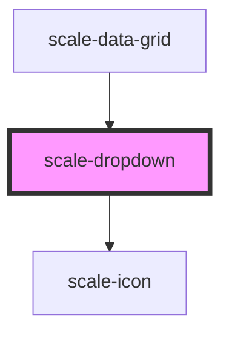

# scale-dropdown

<!-- Auto Generated Below -->

## Properties

| Property      | Attribute      | Description                                                              | Type               | Default       |
| ------------- | -------------- | ------------------------------------------------------------------------ | ------------------ | ------------- |
| `controlled`  | `controlled`   | (optional) Makes type `select` behave as a controlled component in React | `boolean`          | `false`       |
| `disabled`    | `disabled`     | (optional) Input disabled                                                | `boolean`          | `undefined`   |
| `helperText`  | `helper-text`  | (optional) Input helper text                                             | `string`           | `''`          |
| `icon`        | `icon`         | (optional) Input checkbox checked icon                                   | `string`           | `SELECT_ICON` |
| `inputId`     | `input-id`     | (optional) Input checkbox id                                             | `string`           | `undefined`   |
| `label`       | `label`        | (optional) Input label                                                   | `string`           | `''`          |
| `multiple`    | `multiple`     | (optional) select multiple options                                       | `boolean`          | `undefined`   |
| `name`        | `name`         | (optional) Input name                                                    | `string`           | `''`          |
| `placeholder` | `placeholder`  | (optional) Input placeHolder                                             | `string`           | `''`          |
| `required`    | `required`     | (optional) Input required                                                | `boolean`          | `undefined`   |
| `size`        | `size`         | (optional) Input size                                                    | `string`           | `''`          |
| `status`      | `status`       | (optional) Input status                                                  | `string`           | `''`          |
| `styles`      | `styles`       | (optional) Injected CSS styles                                           | `string`           | `undefined`   |
| `transparent` | `transparent`  | (optional) input background transparent                                  | `boolean`          | `undefined`   |
| `value`       | `value`        | (optional) Input value                                                   | `number \| string` | `''`          |
| `visibleSize` | `visible-size` | (optional) the number of visible options in a select drop-down list      | `number`           | `undefined`   |

## Events

| Event          | Description                             | Type                                  |
| -------------- | --------------------------------------- | ------------------------------------- |
| `scaleBlur`    | Emitted when the input loses focus.     | `CustomEvent<void>`                   |
| `scaleChange`  | Emitted when the value has changed.     | `CustomEvent<InputChangeEventDetail>` |
| `scaleFocus`   | Emitted when the input has focus.       | `CustomEvent<void>`                   |
| `scaleInput`   | Emitted when a keyboard input occurred. | `CustomEvent<KeyboardEvent>`          |
| `scaleKeyDown` | Emitted on keydown.                     | `CustomEvent<KeyboardEvent>`          |

## Dependencies

### Used by

 - [scale-data-grid](../data-grid)

### Depends on

- [scale-icon](../icon)

### Graph

----------------------------------------------

*Built with [StencilJS](https://stenciljs.com/)*
