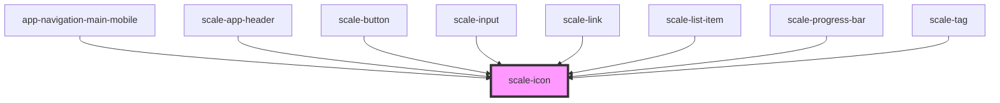

# scale-icon

<!-- Auto Generated Below -->

## Properties

| Property      | Attribute      | Description                                                                                                                                                                                                                                                                                                                                                    | Type      | Default                             |
| ------------- | -------------- | -------------------------------------------------------------------------------------------------------------------------------------------------------------------------------------------------------------------------------------------------------------------------------------------------------------------------------------------------------------- | --------- | ----------------------------------- |
| `ariaLabel`   | `aria-label`   | (optional) When using the icon by itself, add a label to improve accessibility                                                                                                                                                                                                                                                                                 | `string`  | `undefined`                         |
| `customClass` | `custom-class` | (optional) Tag custom class                                                                                                                                                                                                                                                                                                                                    | `string`  | `''`                                |
| `fill`        | `fill`         | The SVG `fill` attribute                                                                                                                                                                                                                                                                                                                                       | `string`  | `'var(--icon-color, currentColor)'` |
| `focusable`   | `focusable`    | (optional) If `true` the icon can receive focus                                                                                                                                                                                                                                                                                                                | `boolean` | `false`                             |
| `name`        | `name`         | A name that will be used to reference an SVG object defined elsewhere, via `<use xlink:href="">`. `icon-` will be prepended to the name, so if you pass `circle`, it will look for for the `icon-circle` id e.g. `<use xlink:href="#icon-circle">`. If there is no element in the document with the id by the name provided, this component will render empty. | `string`  | `undefined`                         |
| `path`        | `path`         | A path shape to be used in the `d` attribute of a path element.                                                                                                                                                                                                                                                                                                | `string`  | `undefined`                         |
| `size`        | `size`         | Will be used for both `width` and `height`, all icons are square. Keep in mind the `viewBox` attribute is set to "0 0 24 24".                                                                                                                                                                                                                                  | `number`  | `24`                                |
| `stroke`      | `stroke`       | The SVG `stroke` attribute                                                                                                                                                                                                                                                                                                                                     | `string`  | `'transparent'`                     |
| `styles`      | `styles`       | (optional) Injected jss styles                                                                                                                                                                                                                                                                                                                                 | `any`     | `undefined`                         |

## Dependencies

### Used by

 - [app-navigation-main-mobile](../app-navigation-main-mobile)
 - [scale-app-header](../app-header)
 - [scale-button](../button)
 - [scale-input](../input)
 - [scale-link](../link)
 - [scale-list-item](../list/listItem)
 - [scale-progress-bar](../progress-bar)
 - [scale-tag](../tag)

### Graph

----------------------------------------------

*Built with [StencilJS](https://stenciljs.com/)*
