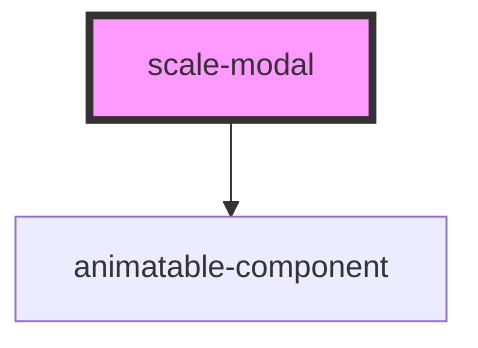

# scale-modal

<!-- Auto Generated Below -->

## Properties

| Property      | Attribute      | Description                            | Type      | Default          |
| ------------- | -------------- | -------------------------------------- | --------- | ---------------- |
| `closeLabel`  | `close-label`  | (optional) Label for close button      | `string`  | `'Close Pop-up'` |
| `customClass` | `custom-class` | (optional) Modal class                 | `string`  | `''`             |
| `opened`      | `opened`       | (optional) If true, the Modal is open. | `boolean` | `false`          |
| `size`        | `size`         | (optional) Modal size                  | `string`  | `'default'`      |
| `styles`      | `styles`       | (optional) Injected jss styles         | `any`     | `undefined`      |
| `transitions` | `transitions`  | (optional) Transition overrides        | `any`     | `undefined`      |
| `variant`     | `variant`      | (optional) Modal variant               | `string`  | `''`             |

## Events

| Event        | Description                                                         | Type                                       |
| ------------ | ------------------------------------------------------------------- | ------------------------------------------ |
| `scaleClose` | (optional) Callback fired when the component requests to be closed. | `CustomEvent<KeyboardEvent \| MouseEvent>` |

## Dependencies

### Depends on

- animatable-component

### Graph

----------------------------------------------

*Built with [StencilJS](https://stenciljs.com/)*
