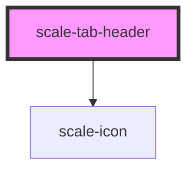

# scale-tab-header

<!-- Auto Generated Below -->

## Properties

| Property   | Attribute   | Description                    | Type                                     | Default     |
| ---------- | ----------- | ------------------------------ | ---------------------------------------- | ----------- |
| `icon`     | `icon`      |                                | `string`                                 | `undefined` |
| `iconOnly` | `icon-only` |                                | `boolean`                                | `undefined` |
| `iconSize` | `icon-size` |                                | `number`                                 | `16`        |
| `label`    | `label`     |                                | `string`                                 | `'Label'`   |
| `selected` | `selected`  |                                | `boolean`                                | `undefined` |
| `styles`   | --          | (optional) Injected jss styles | `StyleSheet<string \| number \| symbol>` | `undefined` |

## Events

| Event      | Description | Type               |
| ---------- | ----------- | ------------------ |
| `tabclick` |             | `CustomEvent<any>` |

## Dependencies

### Depends on

- [scale-icon](../icon)

### Graph

----------------------------------------------

*Built with [StencilJS](https://stenciljs.com/)*
